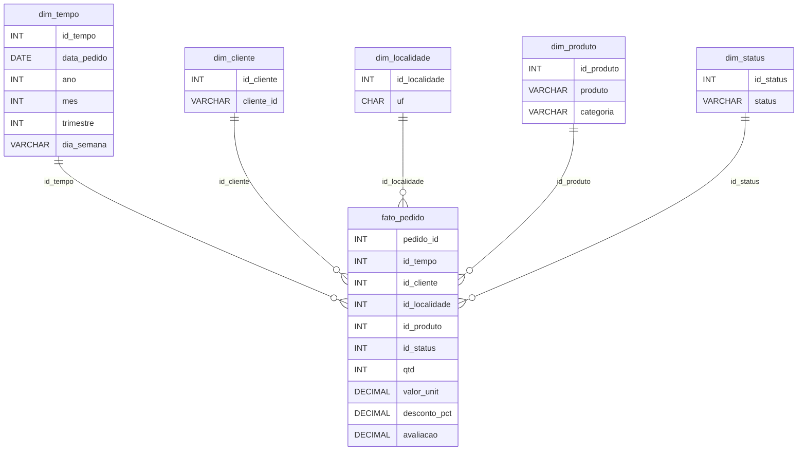

# DER - Modelo Dimensional (Bloco 7)

Fonte canônica do modelo dimensional simplificado do Bloco 7, usando apenas o dataset `data/raw/ecommerce_vendas.csv`.

## Escolha de modelagem

Para este case, a modelagem mais adequada é uma estrela simples.
O arquivo raw já traz os atributos de análise diretamente na mesma tabela e não mostra pedidos com vários produtos diferentes.
Por isso, separar `categoria` em outra dimensão ou introduzir camadas extras de detalhe não agrega valor para responder à Q6.

## Grão da fato

Uma linha por pedido na tabela atual.
Há poucos `pedido_id` repetidos no raw, mas eles aparecem como duplicatas e não como pedidos com itens diferentes.

## Chaves substitutas

Os campos `id_tempo`, `id_cliente`, `id_localidade`, `id_produto` e `id_status` não existem no raw. São chaves substitutas (surrogate keys): inteiros sequenciais gerados no ETL para identificar cada registro único de cada dimensão. Esse é o padrão de modelagem dimensional. A `fato_pedido` os usa como chaves estrangeiras (FK) para as respectivas dimensões. As chaves naturais do raw (`data_pedido`, `cliente_id`, `uf`, `produto`, `status`) ficam como atributos descritivos dentro de cada tabela de dimensão.

## Diagrama

## Tabelas propostas

- `fato_pedido`: tabela central com `pedido_id`, referências para tempo, cliente, localidade, produto e status, além das medidas do raw (`qtd`, `valor_unit`, `desconto_pct`, `avaliacao`).
- `dim_tempo`: organiza a análise temporal com `data_pedido`, `ano`, `mes`, `trimestre` e `dia_semana`.
- `dim_cliente`: permite analisar pedidos por cliente usando `cliente_id`.
- `dim_localidade`: concentra a localização do pedido em `uf`.
- `dim_produto`: concentra `produto` e `categoria` na mesma dimensão para manter o modelo simples.
- `dim_status`: separa o status do pedido para filtros e comparações por situação da venda.

## Tipos principais

- `pedido_id`: `INT`
- `data_pedido`: `DATE`
- `cliente_id`, `produto`, `categoria`, `status`: `VARCHAR`
- `uf`: `CHAR(2)`
- `qtd`: `INT`
- `valor_unit`, `desconto_pct` (renomeado de `desconto_%` do raw para compatibilidade SQL), `avaliacao`: `DECIMAL`
- `ano`, `mes`, `trimestre`: `INT`
- `dia_semana`: `VARCHAR`
