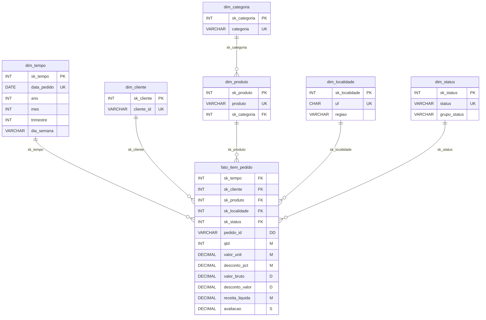

# DER - Modelo Dimensional (Bloco 7)

Fonte canonica do diagrama dimensional do Bloco 7 em Mermaid ER.

## Fonte editavel (Mermaid)

## Legenda de chaves e metricas

- `PK`: `dim_tempo.sk_tempo`, `dim_cliente.sk_cliente`, `dim_produto.sk_produto`, `dim_categoria.sk_categoria`, `dim_localidade.sk_localidade`, `dim_status.sk_status`
- `FK` na fato: `sk_tempo`, `sk_cliente`, `sk_produto`, `sk_localidade`, `sk_status`
- `FK` hierarquia: `dim_produto.sk_categoria -> dim_categoria.sk_categoria`
- `DD`: `fato_item_pedido.pedido_id`
- `M`: `qtd`, `valor_unit`, `desconto_pct`, `receita_liquida`
- `D`: `valor_bruto`, `desconto_valor`
- `S`: `avaliacao`

SK = surrogate key | NK = natural key | DD = dimensao degenerada
